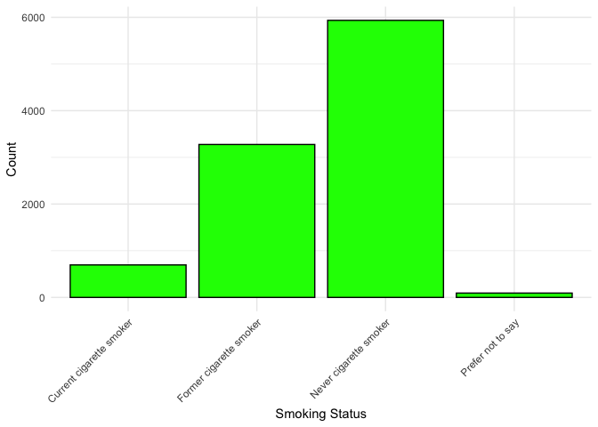

synthReact Package Demo
================
Matthew Whitaker
October 10, 2024

- [Overview](#overview)
- [Installation](#installation)
- [Loading Necessary Packages and
  Functions](#loading-necessary-packages-and-functions)
- [Generating Synthetic Data](#generating-synthetic-data)
- [Data Exploration and
  Visualization](#data-exploration-and-visualization)
  - [Histogram of Age](#histogram-of-age)
  - [Boxplot of BMI by Gender](#boxplot-of-bmi-by-gender)
  - [Bar Plot of Smoking Status](#bar-plot-of-smoking-status)
  - [Correlation Matrix of Continuous
    Variables](#correlation-matrix-of-continuous-variables)
- [Modeling Outcomes](#modeling-outcomes)
  - [Logistic Regression Model for PCR Test
    Result](#logistic-regression-model-for-pcr-test-result)
  - [Odds Ratios and Confidence
    Intervals](#odds-ratios-and-confidence-intervals)
  - [Logistic Regression Model for Long
    COVID](#logistic-regression-model-for-long-covid)
  - [Odds Ratios and Confidence
    Intervals](#odds-ratios-and-confidence-intervals-1)
- [ROC Curve Analysis](#roc-curve-analysis)
  - [Predicted Probabilities and ROC Curve for PCR Test
    Result](#predicted-probabilities-and-roc-curve-for-pcr-test-result)
  - [AUC Value](#auc-value)
- [Conclusion](#conclusion)
- [Additional Notes](#additional-notes)
- [References](#references)

# Overview

This document demonstrates the usage of the `synthReact` R package,
which generates synthetic datasets based on the REACT-1 study
parameters. The package allows users to create realistic synthetic data
for analysis and modeling while preserving data privacy.

# Installation

``` r
# Install devtools if not already installed
install.packages("devtools")

# Install synthReact from GitHub
devtools::install_github("mathzero/synthReact")
```

# Loading Necessary Packages and Functions

``` r
# Load required packages
library(synthReact)
library(ggplot2)
library(dplyr)
library(pROC)
library(corrplot)
```

# Generating Synthetic Data

Generate a synthetic dataset with 1,000 samples:

``` r
# Set seed for reproducibility
seed_value <- 123

# Generate synthetic data
n_samples <- 10000
synthetic_data <- generate_synthetic_data(n_samples = n_samples, seed = seed_value)

# View the first few rows
head(synthetic_data)
```

    ##   age  bmi imd_decile num_comorbidities gender ethnic_new_char
    ## 1  32 23.6          2                 0      2           White
    ## 2  80 33.3          5                 0      2           White
    ## 3  44 20.2          4                 1      1           White
    ## 4  89 35.4         10                 2      1           White
    ## 5  94 32.4          9                 1      1           White
    ## 6   9 27.7          9                 0      2           White
    ##              smokeever_cat                   region
    ## 1  Former cigarette smoker               South West
    ## 2  Former cigarette smoker               South East
    ## 3   Never cigarette smoker Yorkshire and The Humber
    ## 4 Current cigarette smoker               South East
    ## 5   Never cigarette smoker                   London
    ## 6   Never cigarette smoker            East Midlands
    ##   work1_healthcare_or_carehome_worker shielding covid_before vaccinated
    ## 1                                  No        No          Yes        Yes
    ## 2                                  No        No          Yes        Yes
    ## 3                                 Yes        No           No        Yes
    ## 4                                  No        No           No        Yes
    ## 5                                  No        No           No        Yes
    ## 6                                 Yes        No           No        Yes
    ##   symptom_loss_smell symptom_loss_taste symptom_cough symptom_fever
    ## 1                  0                  0             0             0
    ## 2                  0                  0             0             0
    ## 3                  0                  0             0             0
    ## 4                  0                  0             0             0
    ## 5                  0                  0             1             0
    ## 6                  0                  0             0             0
    ##   pcr_test_result longcovid
    ## 1               0         0
    ## 2               0         0
    ## 3               0         0
    ## 4               0         0
    ## 5               0         0
    ## 6               0         0

# Data Exploration and Visualization

## Histogram of Age

``` r
library(ggplot2)

ggplot(synthetic_data, aes(x = age)) +
  geom_histogram(binwidth = 5, fill = "blue", color = "black") +
  labs(x = "Age", y = "Count") +
  theme_minimal()
```

<figure>

<figcaption aria-hidden="true">Histogram of Age</figcaption>
</figure>

## Boxplot of BMI by Gender

``` r
ggplot(synthetic_data, aes(x = gender, y = bmi)) +
  geom_boxplot(fill = "orange", color = "black") +
  labs(x = "Gender", y = "BMI") +
  theme_minimal()
```

<figure>

<figcaption aria-hidden="true">BMI by Gender</figcaption>
</figure>

## Bar Plot of Smoking Status

``` r
ggplot(synthetic_data, aes(x = smokeever_cat)) +
  geom_bar(fill = "green", color = "black") +
  labs(x = "Smoking Status", y = "Count") +
  theme_minimal() +
  theme(axis.text.x = element_text(angle = 45, hjust = 1))
```

<figure>

<figcaption aria-hidden="true">Smoking Status Distribution</figcaption>
</figure>

## Correlation Matrix of Continuous Variables

``` r
library(corrplot)
library(dplyr)

# Select continuous variables
continuous_vars <- synthetic_data %>%
  select(age, bmi, imd_decile, num_comorbidities)

# Compute correlation matrix
cor_matrix <- cor(continuous_vars)

# Visualize the correlation matrix
corrplot(cor_matrix, method = "color", type = "upper",
         tl.col = "black", tl.srt = 45,
         addCoef.col = "black", number.cex = 0.7,
         mar = c(0, 0, 1, 0))
```

<figure>

<figcaption aria-hidden="true">Correlation Matrix of Continuous
Variables</figcaption>
</figure>

# Modeling Outcomes

## Logistic Regression Model for PCR Test Result

``` r
# Convert outcome to factor
# synthetic_data$pcr_test_result <- factor(synthetic_data$pcr_test_result, levels = c(0, 1))

# Fit the model
model_pcr_test_result <- glm(as.formula("pcr_test_result ~ age + symptom_loss_smell+symptom_loss_taste+
                               symptom_cough + symptom_fever + covid_before+vaccinated"),
                             data = synthetic_data, family = binomial)

# Summary of the model
summary(model_pcr_test_result)
```

    ## 
    ## Call:
    ## glm(formula = as.formula("pcr_test_result ~ age + symptom_loss_smell+symptom_loss_taste+\n                               symptom_cough + symptom_fever + covid_before+vaccinated"), 
    ##     family = binomial, data = synthetic_data)
    ## 
    ## Coefficients:
    ##                       Estimate Std. Error z value Pr(>|z|)    
    ## (Intercept)         -4.4492197  0.3037154 -14.649  < 2e-16 ***
    ## age                  0.0008619  0.0016875   0.511   0.6095    
    ## symptom_loss_smell1 -0.0207879  0.4150352  -0.050   0.9601    
    ## symptom_loss_taste1  1.1761245  0.2502733   4.699 2.61e-06 ***
    ## symptom_cough1       2.0740006  0.1338679  15.493  < 2e-16 ***
    ## symptom_fever1       2.0778673  0.1616923  12.851  < 2e-16 ***
    ## covid_beforeYes      1.3937075  0.0975890  14.281  < 2e-16 ***
    ## vaccinatedYes        0.5051182  0.2857013   1.768   0.0771 .  
    ## ---
    ## Signif. codes:  0 '***' 0.001 '**' 0.01 '*' 0.05 '.' 0.1 ' ' 1
    ## 
    ## (Dispersion parameter for binomial family taken to be 1)
    ## 
    ##     Null deviance: 4225.4  on 9999  degrees of freedom
    ## Residual deviance: 3695.8  on 9992  degrees of freedom
    ## AIC: 3711.8
    ## 
    ## Number of Fisher Scoring iterations: 6

## Odds Ratios and Confidence Intervals

``` r
# Odds ratios and confidence intervals
exp(cbind(OddsRatio = coef(model_pcr_test_result), confint(model_pcr_test_result)))
```

    ##                      OddsRatio       2.5 %      97.5 %
    ## (Intercept)         0.01168768 0.006183413  0.02048475
    ## age                 1.00086228 0.997556901  1.00417990
    ## symptom_loss_smell1 0.97942671 0.396393709  2.06029869
    ## symptom_loss_taste1 3.24178628 1.940809295  5.19620484
    ## symptom_cough1      7.95659049 6.101106530 10.31648685
    ## symptom_fever1      7.98741559 5.785706885 10.91539097
    ## covid_beforeYes     4.02976283 3.334211465  4.88911899
    ## vaccinatedYes       1.65718132 0.982538773  3.03502234

## Logistic Regression Model for Long COVID

``` r
# Convert outcome to factor
synthetic_data$longcovid <- factor(synthetic_data$longcovid, levels = c(0, 1))

# Fit the model
model_longcovid <- glm(longcovid ~ age + gender + bmi + smokeever_cat + num_comorbidities,
                       data = synthetic_data, family = binomial)

# Summary of the model
summary(model_longcovid)
```

    ## 
    ## Call:
    ## glm(formula = longcovid ~ age + gender + bmi + smokeever_cat + 
    ##     num_comorbidities, family = binomial, data = synthetic_data)
    ## 
    ## Coefficients:
    ##                                       Estimate Std. Error z value Pr(>|z|)    
    ## (Intercept)                          -4.395486   0.382551 -11.490  < 2e-16 ***
    ## age                                  -0.001470   0.002239  -0.656  0.51152    
    ## gender2                               0.211458   0.122357   1.728  0.08395 .  
    ## bmi                                   0.028446   0.010900   2.610  0.00906 ** 
    ## smokeever_catFormer cigarette smoker -0.074011   0.230241  -0.321  0.74787    
    ## smokeever_catNever cigarette smoker  -0.281633   0.223237  -1.262  0.20710    
    ## smokeever_catPrefer not to say        0.229400   0.552802   0.415  0.67816    
    ## num_comorbidities                     0.276768   0.065376   4.234  2.3e-05 ***
    ## ---
    ## Signif. codes:  0 '***' 0.001 '**' 0.01 '*' 0.05 '.' 0.1 ' ' 1
    ## 
    ## (Dispersion parameter for binomial family taken to be 1)
    ## 
    ##     Null deviance: 2646.0  on 9999  degrees of freedom
    ## Residual deviance: 2614.5  on 9992  degrees of freedom
    ## AIC: 2630.5
    ## 
    ## Number of Fisher Scoring iterations: 6

## Odds Ratios and Confidence Intervals

``` r
# Odds ratios and confidence intervals
exp(cbind(OddsRatio = coef(model_longcovid), confint(model_longcovid)))
```

    ##                                       OddsRatio       2.5 %    97.5 %
    ## (Intercept)                          0.01233289 0.005751073 0.0257944
    ## age                                  0.99853131 0.994156461 1.0029253
    ## gender2                              1.23547808 0.973902906 1.5741788
    ## bmi                                  1.02885419 1.007128310 1.0510972
    ## smokeever_catFormer cigarette smoker 0.92866128 0.602118007 1.4907089
    ## smokeever_catNever cigarette smoker  0.75455021 0.496958340 1.1968697
    ## smokeever_catPrefer not to say       1.25784494 0.362854316 3.3558374
    ## num_comorbidities                    1.31886067 1.158871231 1.4975863

# ROC Curve Analysis

## Predicted Probabilities and ROC Curve for PCR Test Result

``` r
library(pROC)

# Predicted probabilities for PCR Test Result
synthetic_data$predicted_prob_pcr <- predict(model_pcr_test_result, type = "response")

# ROC Curve for PCR Test Result
roc_pcr_test <- roc(as.numeric(synthetic_data$pcr_test_result), synthetic_data$predicted_prob_pcr)

# Plot ROC Curve
plot(roc_pcr_test, col = "red", main = "ROC Curve for PCR Test Result")
```

<figure>

<figcaption aria-hidden="true">ROC Curve for PCR Test
Result</figcaption>
</figure>

## AUC Value

``` r
# AUC Value
auc_value_pcr <- auc(roc_pcr_test)
print(paste("AUC for PCR Test Result:", round(auc_value_pcr, 3)))
```

    ## [1] "AUC for PCR Test Result: 0.745"

# Conclusion

This demo showcases how to generate and analyze synthetic data using the
`synthReact` package. The synthetic data preserves the statistical
properties of the original REACT-1 study data, allowing for meaningful
analysis while ensuring data privacy.

------------------------------------------------------------------------

# Additional Notes

- **Plots**: The images included in this document are generated when you
  knit the R Markdown file. Ensure that you have the necessary packages
  installed.

- **Package Dependencies**: Make sure to install all required packages
  before running the script:

  ``` r
  install.packages(c("ggplot2", "dplyr", "pROC", "corrplot"))
  ```

- **Data Privacy**: The synthetic data generated does not contain any
  real participant information from the REACT-1 study, maintaining
  confidentiality.

# References

- **synthReact GitHub Repository**:
  [synthReact](https://github.com/mathzero/synthReact)

- **REACT-1 Study**: [Official
  Website](https://www.imperial.ac.uk/medicine/research-and-impact/groups/react-study/studies/the-react-1-programme/)

------------------------------------------------------------------------
